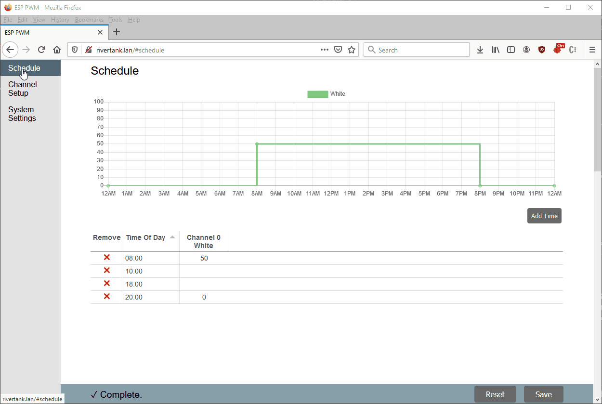

# ESP PWM
A PWM timer/scheduler for ESP32 devices. Designed to control aquarium lighting on a daily schedule. Up to 8 channels of independent control, 4 independent PWM frequencies and schedule granularity down to the minute.

## Demo

## Features
ESP PWM supports 8 channel of independent PWM control on arbitrary GPIOs. Frequency of each channel can be selected from 4 independent sources. Each channel can be assigned a name for easy reference.

### Automatic Time Sync
ESP PWM maintains time via NTP. However for correct local time, a proper timezone must be configured. Timezone and NTP servers are configured under System Settings.

#### Timezones
ESP PWM recognizes POSIX style timezones. e.g. Mountain Time (America/Denver) is represented as `MST7MDT,M3.2.0,M11.1.0`. Other timezones can be found [here](https://sites.google.com/a/usapiens.com/opnode/time-zones).

### Sweep Generation
The web interface can generate sweeps to slowly ramp up/down the light intensity over time. Right click the channel header to access the context menu and add a sweep.

### Scaling
ESP PWM can scale all values for a given channel. Select `Scale` in the channel context menu by right clicking on the channel header.

### Backup & Restore
All settings, configuration and the schedule can be backed up and restored from your local computer. Backup & restore is found under System Settings.

## Hardware
While driving small LEDs directly is possible, controlling larger LED strips will require an driver. A MOSFET in a low-side switch configuration may be sufficient, but likely a constant-current LED driver such as the [PicoBuck](https://www.sparkfun.com/products/13705) or [Femtobuck](https://www.sparkfun.com/products/13716) will be required. ESP PWM can control any device that supports 3.3 V signaling.

## Color Palette
https://coolors.co/e4e3e3-88a0a8-546a76-000000